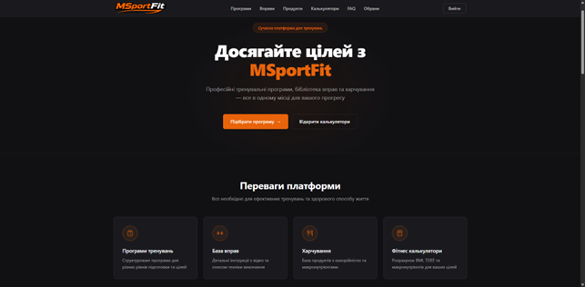
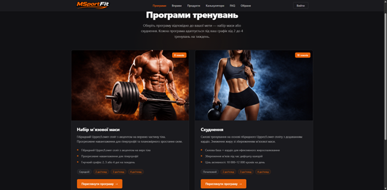
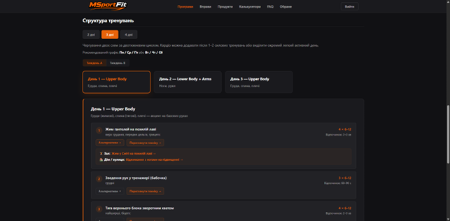
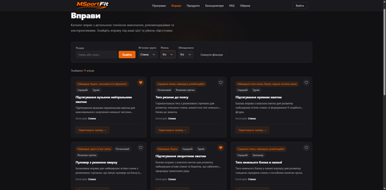
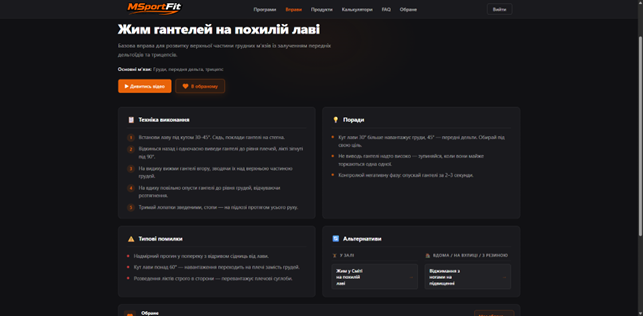
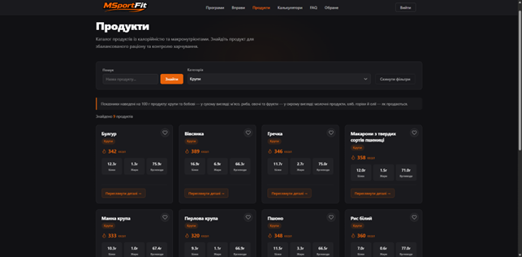
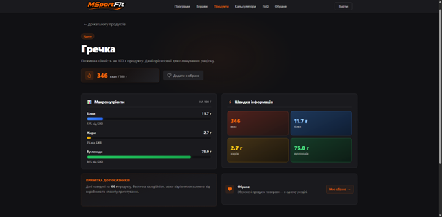
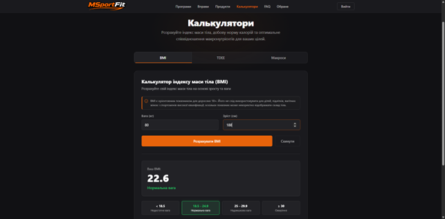
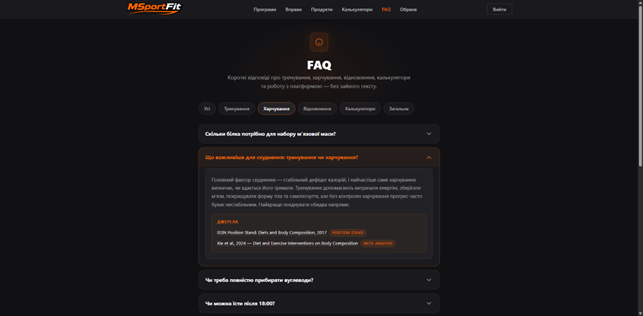
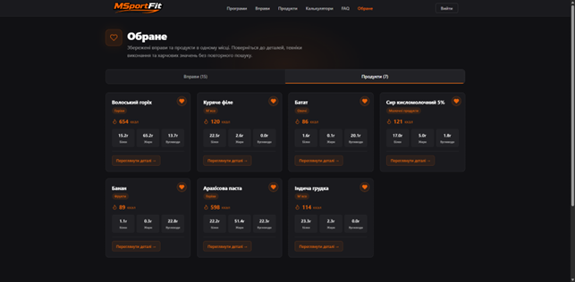

# MSportFit

**MSportFit** — інформаційна система підтримки спортивних тренувань і харчування у вигляді адаптивного україномовного вебзастосунку.

Користувач отримує єдину платформу для роботи з тренуваннями, базою вправ, харчуванням і фітнес-калькуляторами. Інтерфейс орієнтований на десктоп і мобільні пристрої, оформлений у темній темі з акцентним брендом MSportFit.

---

## Основні можливості

- **Програми тренувань** для набору м'язової маси та схуднення з адаптацією під 2–4 тренування на тиждень.
- **Каталог вправ** із технікою виконання, порадами, типовими помилками та альтернативами (для залу і для дому).
- **Каталог продуктів** із калорійністю та повним розкладом БЖВ на 100 г.
- **Калькулятори** BMI, TDEE та БЖВ із візуалізацією результатів і рекомендаціями.
- **FAQ** з відповідями на типові питання щодо тренувань, харчування та відновлення, частина відповідей підкріплена науковими джерелами.
- **Авторизація та реєстрація** користувачів (JWT-сесія).
- **Обране** для вправ і продуктів — швидкий доступ до збережених елементів.

---

## Технології

| Шар        | Стек                                                |
| ---------- | --------------------------------------------------- |
| Frontend   | React, Vite, JavaScript, SCSS, Redux Toolkit        |
| Backend    | Node.js, Express                                    |
| Database   | PostgreSQL                                          |
| ORM        | Prisma                                              |

---

## Скріншоти

| Сторінка                         | Превʼю                                                          |
| -------------------------------- | --------------------------------------------------------------- |
| Головна                          |                               |
| Програми тренувань               |                       |
| Деталі програми тренувань        |         |
| Каталог вправ                    |                     |
| Деталі вправи                    |       |
| Каталог продуктів                |                       |
| Деталі продукту                  |         |
| Калькулятори                     |                 |
| FAQ                              |                                 |
| Обране                           |                     |

> Файли скріншотів зберігаються у `docs/screenshots/`. Як тільки відповідні PNG будуть додані у репозиторій, вони автоматично відобразяться у цій таблиці.

---

## Локальний запуск

### 1. PostgreSQL через Docker

```bash
docker compose up -d
```

Це підніме сервіс PostgreSQL, описаний у `docker-compose.yml`, і зробить його доступним для backend-а.

### 2. Backend (`server`)

```bash
cd server
npm install
npm run dev
```

Перед першим запуском заповніть `.env` (зокрема `DATABASE_URL` і `JWT_SECRET`) та виконайте міграції Prisma:

```bash
npm run prisma:generate
npm run prisma:migrate
```

### 3. Frontend (`client`)

```bash
cd client
npm install
npm run dev
```

Vite-сервер за замовчуванням підіймається на `http://localhost:5173` і проксіює `/api` на backend (`http://localhost:3001`).

---

## GitHub Pages

Frontend опубліковано як **публічну demo-версію** через GitHub Pages:

**Demo:** https://mishasamonov.github.io/MSportFit_demo/

GitHub Pages обслуговує лише статичну збірку клієнтської частини (`client/dist`). Це **frontend demo** для ознайомлення з інтерфейсом і навігацією; повна функціональність із backend і базою даних доступна при локальному запуску згідно з інструкцією вище.

---

## Статус

Система реалізована локально та працює як повноцінне рішення з frontend, backend і базою даних. GitHub Pages використовується для **публічної демонстрації frontend-частини**.

---

## Автор

**Misha Samonov** / Самонов Михайло
